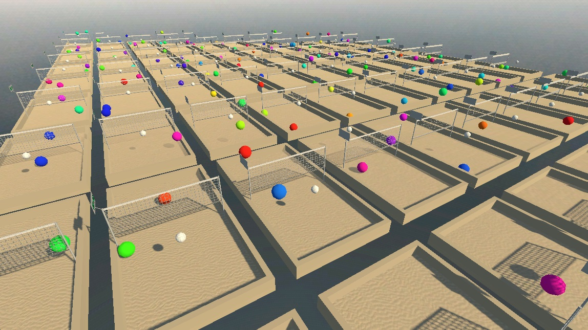

# Volley3d AI [WIP]
This is a simple environment designed in Godot for trying out different variations of self-play reinforcement learning.

AI players are controlled by a Multilayer Perceptron implemented using the slightly modificated [LargeLinearAlgebra](https://github.com/Johnnoe2618/large-linear-algebra) GDExtension (just had added several in-place activation functions and recompiled the dlls).

The env is supposed to receive AI players' weights and biases from a ml server script (where all the actual reinforcement learning is performed), act for a while and store transitions, then send the transitions back to the ml script, etc. [Not Yet Implemented]